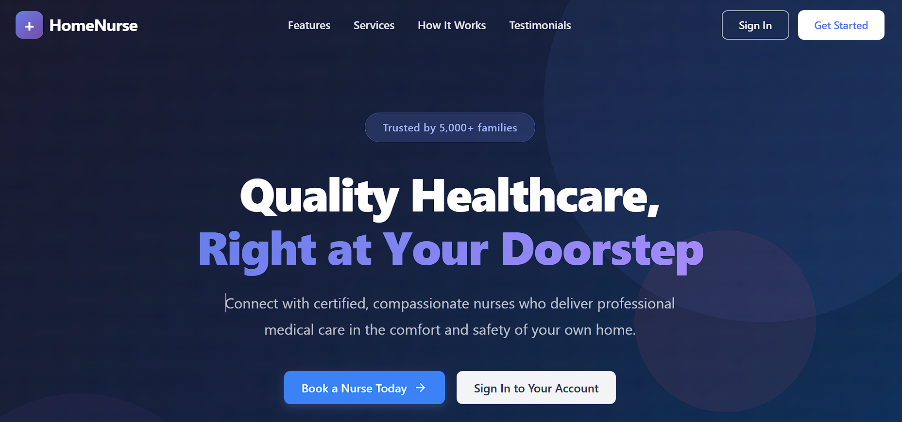
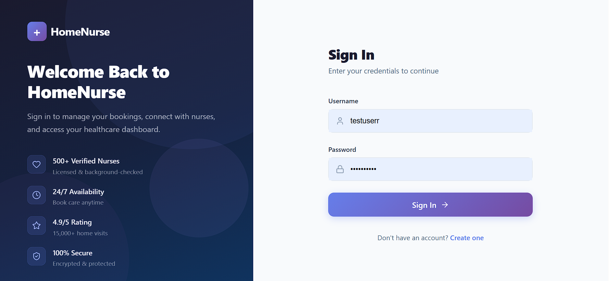
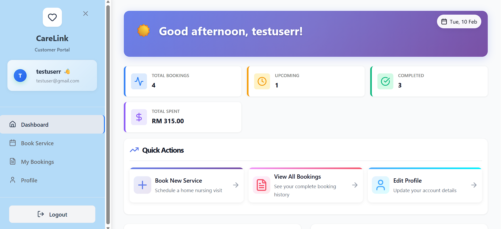
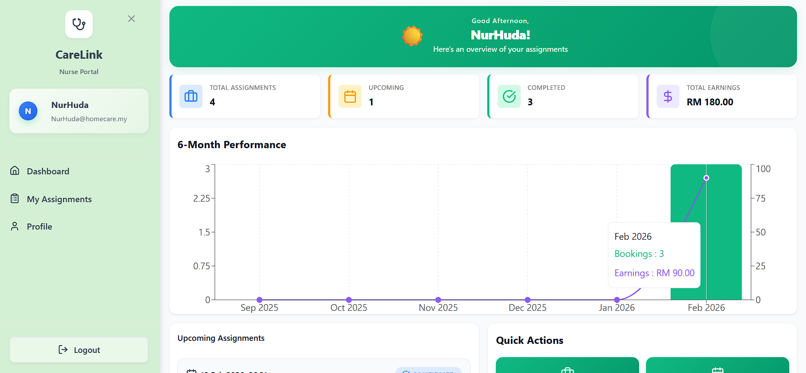
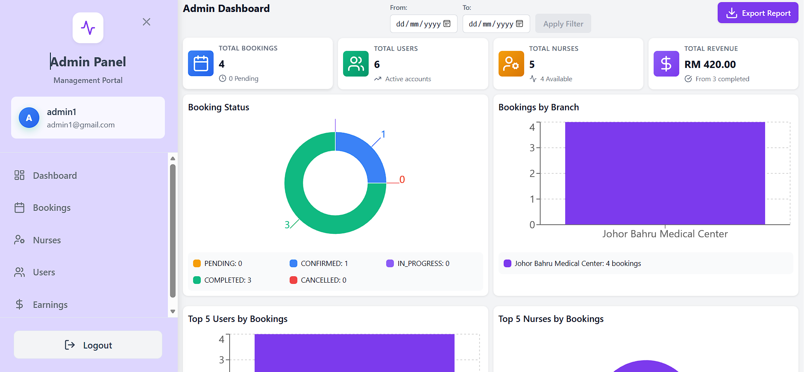
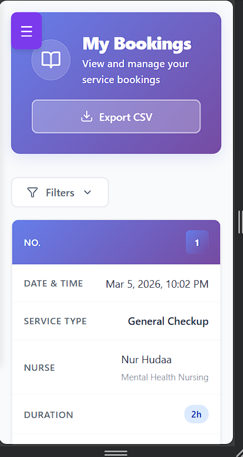

# Home Nursing Service System

A comprehensive full-stack web application for managing home nursing services and bookings. This system connects patients with qualified nurses, enabling efficient scheduling and service management.

## Preview

### Homepage


### Login / Register


### Customer Dashboard


### Nurse Dashboard


### Admin Dashboard


### Mobile View


## Project Overview

The Home Nursing Service System is designed to streamline home-based nursing service operations with three main user roles:

- **Customers (Patients)**: Book nursing services and manage their accounts
- **Nurses**: Accept service assignments and manage their profile
- **Administrators**: Monitor all bookings, manage users, and track system operations

## Key Features

### For Customers
- **Easy Booking**: Schedule nursing services with available nurses
- **Profile Management**: Update personal information
- **Booking History**: View past and upcoming appointments
- **Invoice Management**: Track payments and download invoices
- **Secure Authentication**: Login and registration with JWT tokens

### For Nurses
- **Assignment Management**: View and accept nursing assignments
- **Earnings Tracking**: Monitor earnings and completed services
- **Profile Setup**: Manage qualifications and hourly rates
- **Real-time Status**: Track assignment updates

### For Administrators
- **Dashboard**: Monitor all system activities
- **Nurse Management**: Register and manage nurses
- **Booking Management**: View and manage all bookings
- **Earnings Report**: Track nurse earnings and statistics
- **Advanced Statistics**: Average earnings, median, top performers
- **User Management**: Manage all users in the system

## Tech Stack

### Backend
- **Framework**: Spring Boot (Java)
- **Database**: MySQL/MariaDB with Liquibase migrations
- **Authentication**: JWT (JSON Web Tokens)
- **API**: RESTful API
- **Build Tool**: Maven

### Frontend
- **Framework**: React 19
- **Build Tool**: Vite
- **Routing**: React Router v7
- **HTTP Client**: Axios
- **UI Components**: Lucide React Icons
- **Charts**: Recharts
- **Styling**: CSS3

## Installation Guide

### Prerequisites
- Java JDK 17+
- Node.js 18+
- MySQL 8.0+
- Maven 3.8+

### Setup

1. **Database**
   ```sql
   CREATE DATABASE home_nursing_db;
   ```

2. **Backend**
   ```bash
   cd backend
   # Configure database in src/main/resources/application.properties
   ./mvnw spring-boot:run
   ```
   Backend runs on `http://localhost:8080`

3. **Frontend**
   ```bash
   cd frontend
   npm install
   npm run dev
   ```
   Frontend runs on `http://localhost:5173`

## User Roles

1. **CUSTOMER**: Can book services, view booking history, manage profile, access invoices
2. **NURSE**: Can view assignments, accept/reject bookings, manage profile, view earnings
3. **ADMIN**: Full system access - manage users, bookings, nurses, view reports

## Features Highlights

### Admin Earnings Dashboard
- Real-time earnings metrics (total, average, median)
- Statistics cards (highest, lowest earnings, average bookings)
- Filter by month and sort options
- Export earnings data to CSV
- Detailed table with nurse information

### Admin Booking Management
- View all bookings with detailed information
- Search and filter by status
- Update booking status
- Complete booking details view

### Customer Booking Portal
- Search and book available nurses
- View booking history
- Access and download invoices
- Manage profile information

### Nurse Dashboard
- View new assignment requests
- Accept or reject bookings
- Track total earnings
- Manage professional profile

## System Workflow

1. **User Registration & Login**:
   - User creates account as CUSTOMER or NURSE
   - JWT token issued on login for authenticated requests

2. **Service Booking** (Customer):
   - Browse available nurses by service type
   - Select date, time, and nurse
   - Create booking (initial status: PENDING)

3. **Booking Assignment** (Nurse):
   - Nurse receives notification of pending bookings
   - Can ACCEPT or REJECT the assignment
   - Accepted bookings change to CONFIRMED status

4. **Service Completion** (Nurse + Admin):
   - Nurse completes the service
   - Admin updates booking to COMPLETED
   - System generates invoice for payment

5. **Earnings & Reporting** (Admin):
   - Admin tracks completed bookings
   - View earnings report by month
   - Export data for records

**Last Updated**: February 2026
